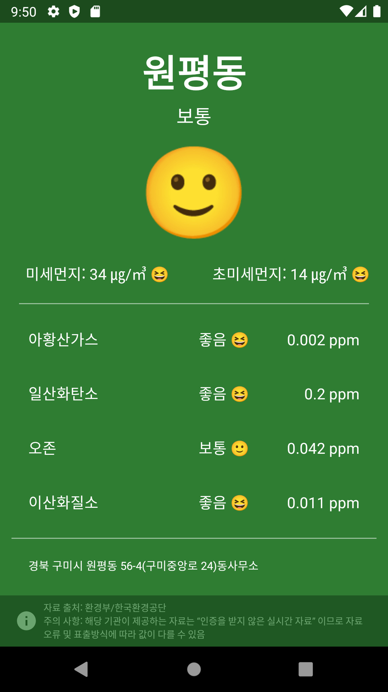
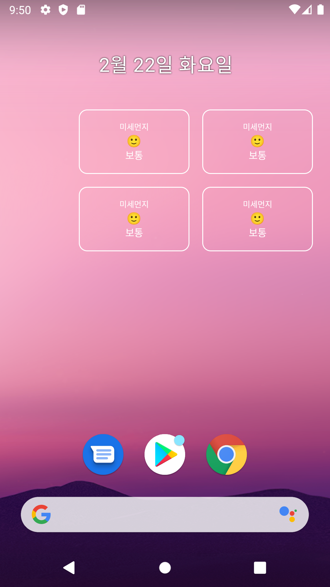

# Android Clone Coding Project #21 Dust
실시간 대기 정보를 알 수 있음
 
실시간 대기 정보의 단계에 따라 색상이 다름
 
위젯을 통해 간단하게 볼 수 있음
 
# 결과화면
|Screenshot1|Screenshot2|
|---|---|
|||

 

# 배운 내용 정리
- LocationManager
- Retrofit
- Coroutine
- App Widget
- AppWidgetProviderInfo
- AppWidgetProvider
- Layout

